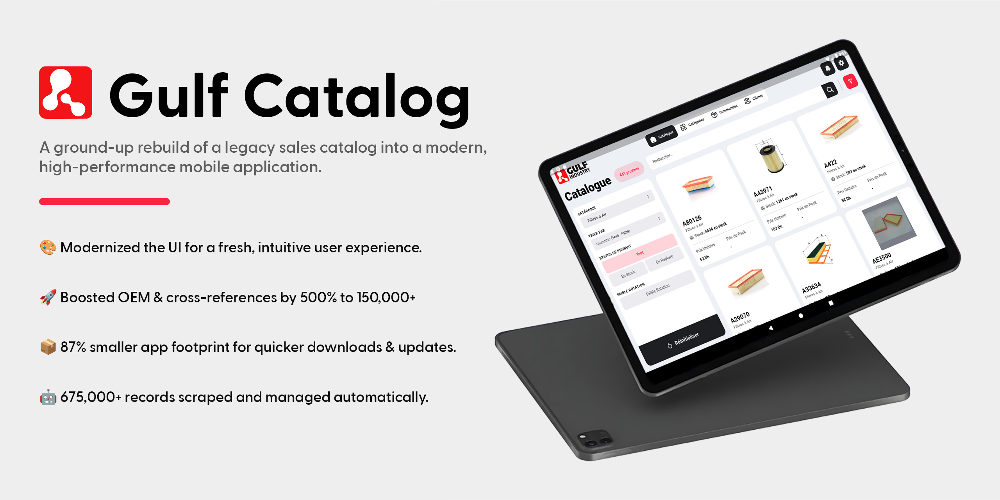
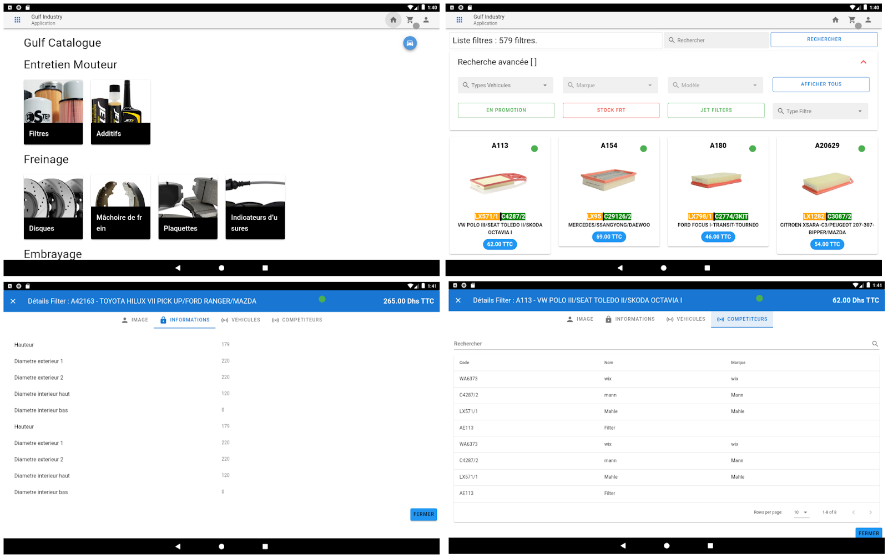
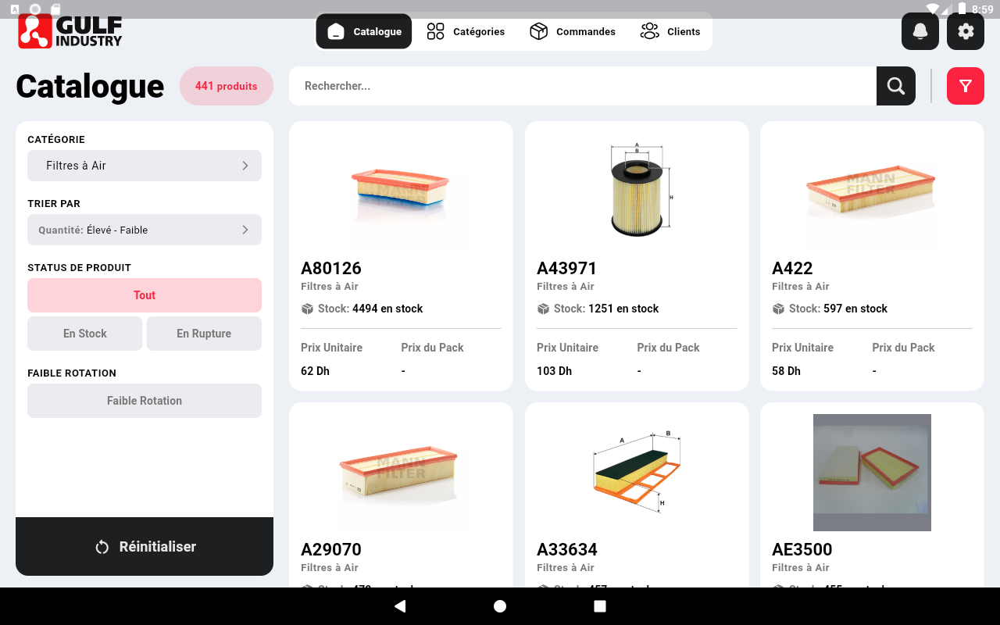
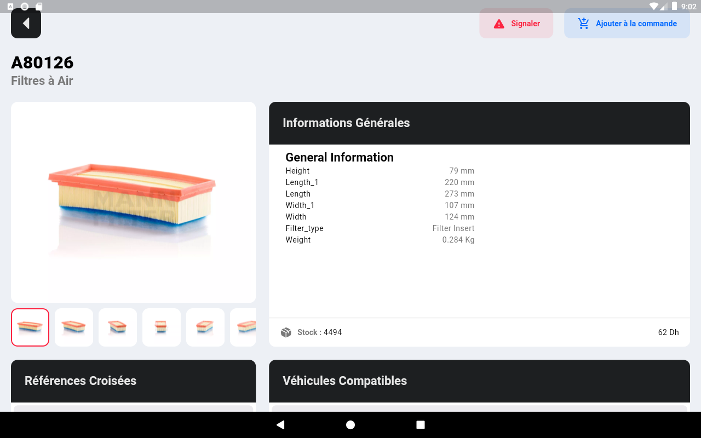
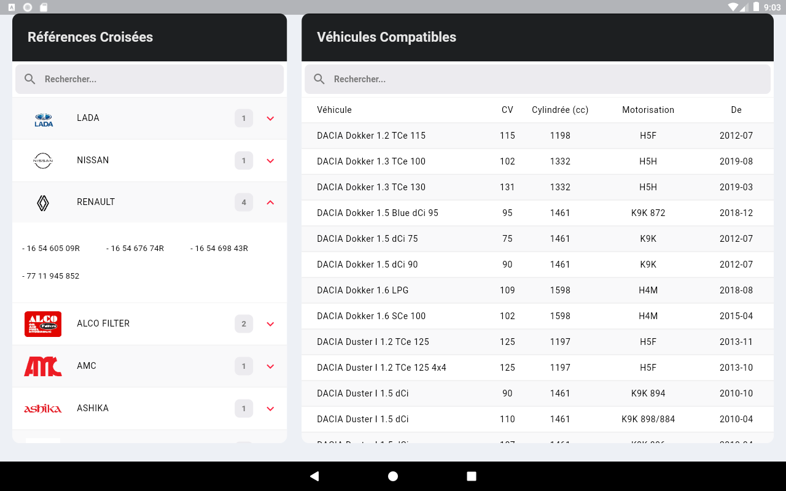

# Gulf Catalog App



<p align="center">
  
    
  
  
</p>

This repository contains the source code for a rebuilt mobile catalog application for **Gulf Industry**, a leading distributor of vehicle spare parts. The project was developed as part of an initiation internship, focusing on modernizing the existing application to improve performance, user experience, and data management.

The new application is built with **Flutter** for a high-performance, cross-platform frontend and is powered by a **Supabase** backend. It features a scalable client-server architecture and an automated data pipeline using **web scraping** to keep the product catalog up-to-date.

## Table of Contents

- [The Challenge](#the-challenge)
- [The Solution](#the-solution)
- [Key Features](#key-features)
- [images](#images)
- [Getting Started](#getting-started)
- [Roadmap for Future Improvements](#roadmap-for-future-improvements)

## The Challenge

The original mobile catalog app, while functional, suffered from several issues that hindered the sales team's efficiency:

- **Performance Bottlenecks:** Built with Vue.js and Capacitor, the app was slow, especially on the tablets used by the sales team.
- **Large App Size:** With all product data stored locally, the app had a footprint of over 300MB, making updates cumbersome.
- **Inconsistent UI/UX:** Different product categories had varying layouts, leading to a confusing user experience.
- **Difficult Updates:** Adding or updating products required a full application update and redeployment.
- **Poor Scalability:** The architecture made it difficult to introduce new features like an admin dashboard or advanced analytics



## The Solution

This project involved rebuilding the application from the ground up to address these challenges. The new solution provides:

- **Native Performance:** By using Flutter, the app now compiles to native code, ensuring a smooth and responsive experience.
- **Centralized & Live Data:** Product data is now fetched in real-time from a central PostgreSQL database managed by Supabase. This reduces the app's size and ensures data is always current.
- **Automated Data Pipeline:** A web scraping script, run by an edge function, automatically fetches and cleans product data from supplier websites, ensuring the catalog is always current.
- **Modern and Consistent UI:** The user interface has been redesigned for consistency, ease of navigation, and a professional look.

## Key Features

- **Dynamic Product Catalog:** Browse thousands of products with high-quality images, prices, and live stock levels.
- **Advanced Search:** Search for products by company reference, competitor reference, or Original Equipment Manufacturer (OEM) number.
- **Filtering and Sorting:** Filter products by category and availability. Sort results by price, reference, or stock.
- **Detailed Product View:** Access comprehensive product details, including dimensions, compatible vehicles, and cross-references to alternative parts.
- **Cross-Reference Lookups:** Easily find substitute products from different brands and manufacturers.

## images

<table>
  <tr>
    <td width="30%" valign="top">
      <strong>Catalog Page</strong>
      <p>The main screen of the app, showcasing a filterable list of products with key details like price and stock status.</p>
    </td>
    <td width="70%">
      
    </td>
  </tr>
  <tr>
    <td width="30%" valign="top">
      <strong>Product Details</strong>
      <p>A detailed view providing comprehensive technical specifications, dimensions, and multiple product images.</p>
    </td>
    <td width="70%">
      
    </td>
  </tr>
  <tr>
    <td width="30%" valign="top">
      <strong>Cross-References & Vehicle Compatibility</strong>
      <p>A powerful feature allowing users to find substitute parts and verify compatibility with specific vehicle models.</p>
    </td>
    <td width="70%">
      
    </td>
  </tr>
</table>

## Getting Started

To get a local copy up and running, follow these simple steps.

### Prerequisites

- Flutter SDK installed.
- A Supabase account.

### Installation

1.  **Clone the repository:**
    ```sh
    git clone https://github.com/your-username/gulf-industry-app.git
    cd gulf-industry-app
    ```
2.  **Install Flutter packages:**
    ```sh
    flutter pub get
    ```
3.  **Set up Supabase:**
    - Go to your [Supabase project dashboard](https://supabase.io/). In the project settings, find your API URL and `anon` key under the **API** section.
    - This project uses the `flutter_dotenv` package to securely manage environment variables. In the root directory of the Flutter project, create a new file named `.env`.
    - Add your Supabase credentials to the `.env` file with the following keys. **Replace the placeholder values with your actual credentials.**
      ```env
      SUPABASE_URL=https://your-project-ref.supabase.co
      SUPABASE_ANON_KEY=your-supabase-anon-key
      ```
4.  **Run the app:**
    ```sh
    flutter run
    ```

## Roadmap for Future Improvements

- [ ] **Implement Offline-First Capability.**
- [ ] **Advanced Search Functionalities.**
- [ ] **Admin Dashboard:**
